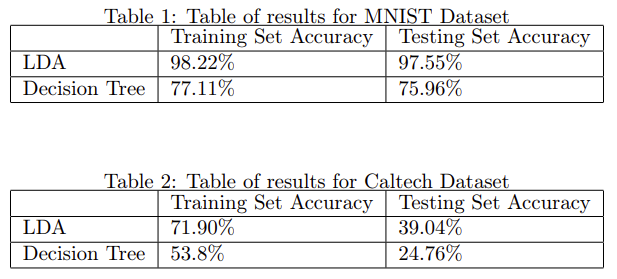

# Implementation of Linear Disriminant Analysis (LDA) and Greedy Decision Tree (GDT)

This project was conducted in a Pattern Recognition course where each group was randomly assigned classifiers to implement and image sets to implement. We got the MNIST and Caltech10 image sets along with LDA and GDT classifiers. The code here is the algorithm implementations and imaging pipelines that utilized the algorithm functions. 

## Results

Here are the accuracies of the classifiers with each training and testing image set.

## Data

### Caltech10 image set

This image set is a derivative of the Caltech101 image set that can be found [here](http://www.vision.caltech.edu/Image_Datasets/Caltech101/101_ObjectCategories.tar.gz). The Caltech10 image set consists of the following classes from Caltech101: 'ant', 'bass', butterfly', 'camera', 'chair', 'crab', 'dolphin', 'elephant', 'sunflower', and 'yin_yang'. Some images in these classes are randomly selected to be removed so that all classes have the same number of images as to not weight the image set in one class over any other. 

### MNIST image set

The MNIST image set is a standard set in computer vision and can be found [here](http://yann.lecun.com/exdb/mnist/). In order for this code to work, you need to download the training set from that website (60000 images in the form of a CSV), name it mnist.csv, and put it into the MNIST folder. This dataset contains 60000 28x28 images with a handwritten number in it. The first column of the CSV has the number/class of the image and then the rest of the columns in a row contain the actual image data. 

## Description of files

* CaltechGDT.m, CaltechLDA.m, MNIST_GDT.m, MNIST_LDA.m: These scripts contain the imaging pipeline that takes the images, performs feature extraction, and passes these features onto the algorithm function. 
* LDA.m, GreedyDecisionTree.m: These are functions that implement the classifiers
* Impurity.m: Used by GreedyDecisionTree.m to calculate the impurity of a node in the decision tree
* CrossValidateGDT.m: Function that will perform the cross validation for the GDT algorithm to find the optimal hyperparameters for each image set

## Additional Items

* Reports folder contains the written reports for the 2 parts of this project as well as the presentation containing highlights of the project
